# Eendragt

## Applications

Eendragt lets users apply for certain positions. Currently there are four:

* **NL-Diplomat** - A member who keeps contact with other communities.
* **Community Support** - A member who moderates in the community.
* **Pixel Artists** - A member who creates artwork for the suggestions.
* **Editor** - A member who collects and creates information for the PlaceNL News.

When you click on one of the buttons you will be presented with a modal where you can submit your application.

Once you have submitted your application, the bot sends your application to an application channel. Here the managers of the category you applied to can review your application. This will include the roles you had last year. For example, we know if you were also an NL-diplomat before.

With the command `/rol` a moderator can give the role NL Diplomat and Pixel Artist to another member. With the same command, the role can also be taken away again.

## Threads

With the Manage Threads permission, a member could delete all threads. To prevent this, Eendragt has functionality to allow threads to be managed without being able to delete them.

### Tags

The `/tags` command allows a moderator (and Community Support) to edit the tags of a thread.

After you use the command you will be presented with a dropdown menu. Here you can select one or more tags. These tags will then be added to the thread.

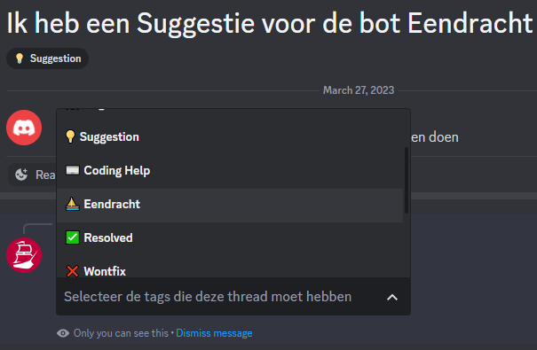

### Close and lock

The `/close` command can be used to close a thread. A reason can be given with this, which can then be seen in the logs.

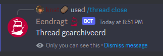

Similarly, the `/lock` command can be used to lock a thread.

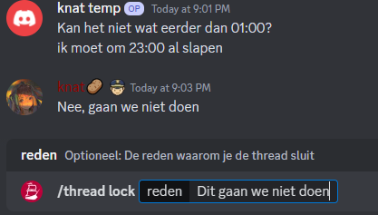

## Suggestions

The suggestion channel is the heart of our democracy. To make everything as fair as possible, Eendragt automates the process for a suggestion to be nominated to the canvas.

When someone makes a new post with a suggestion, the bot automatically sends a message. It also tracks and checks if a similar suggestion has been made before. If so, it is added to the post. The creator of the thread, or a moderator, can then choose whether to close the thread.

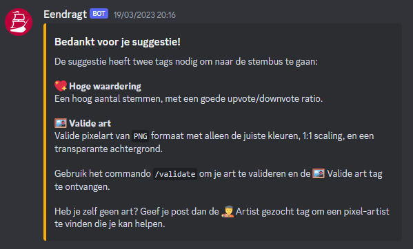

When creating the suggestion, the bot automatically gives it an upvote and downvote reaction. Members can use these emoji to vote for the suggestion. With a high number of upvotes (and comparatively few downvotes), the suggestion will receive a 💖 High rating tag.

### Art

When a suggestion is made with the 🎨 New Art tag or the ✨ Upgrade Art tag, the suggestion must have valid art to be nominated. Art can be validated with the `/validate` command.

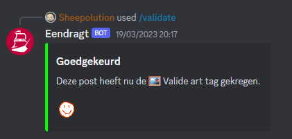

Valid art meets the following criteria:

* It is a PNG file.
* It has a transparent background.
* It uses only the colors that r/place uses.
* It is 1x1 scaling.

All these four criteria are checked by the bot. If one of the four is wrong, the bot will indicate what exactly is wrong.

When a suggestion has the necessary tags, it will be nominated. A message will be sent in the #nomination channel, and the suggestion will receive a ⭐ Nomination tag.

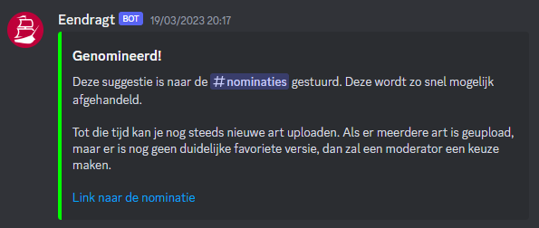

### Nominations

When a suggestion is nominated, a message is sent in the #nomination channel.

Through menu commands, a canvas coordinator can determine what to do with the nomination. There are four options for this:
* Approve - It is clear that people want it, and it needs no further vote.
* Ballot - It goes to the official ballot to determine if it goes on the canvas.
* Defer - It is a good suggestion, but there is currently no place for it on the canvas.
* Disapprove - The suggestion violates the rules.

After executing the menu command, a modal comes up. Here you are asked to confirm the action by typing it. This prevents accidentally executing the wrong action. Furthermore, a reason can be given for the action.

After executing the command, the original message is updated with the new status.

## Art

### Coordination

The `/coordinate` command can be used to coordinate the placement of artworks on the canvas, without the need for an autoplacer. When executing the command, you must provide an image, an x and y position, and optionally a time when to place the pixels.

After using the command, a message appears containing the information entered. Members can click the button to claim a pixel.

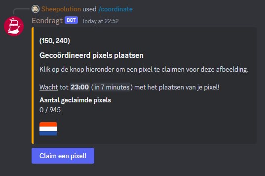

The member is told where and when to place a pixel, and of what color. When all members do this at the same time, in no time there should be the artwork on the canvas.

### Grid

The `/grid` command can be used to generate a grid with the given pixel art. This grid contains the x and y coordinates of each pixel, according to the given position. This image can be used as a guide when placing pixels manually.

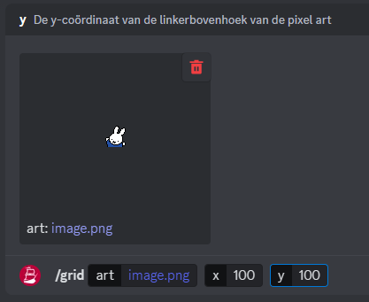

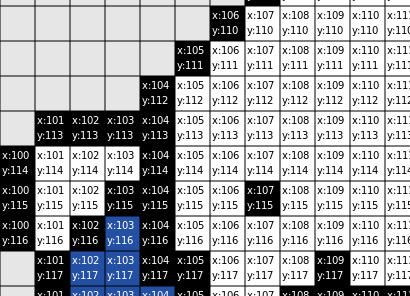

### Template

The `/template` command can be used to generate an image the size of the canvas, with the given pixel art at the given position. This is useful for Canvas Coordinators when they need to place the art in the template.

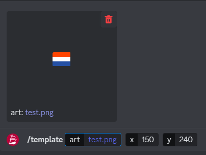

## Vote

With Eendragt you can cast a vote. You start a vote with the `/stemming` command. Here you specify an image, and optionally how long the vote should last.

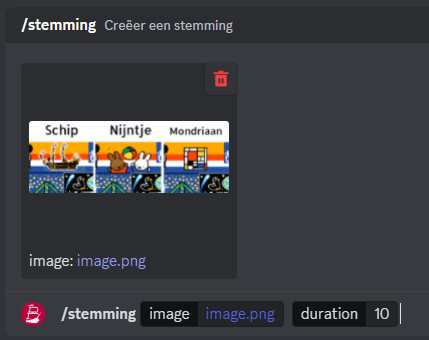

When you do this you will see a modal. In the first box you enter a description. This is optional, and if left blank it will have a default text.

The second box is also optional, and should only be filled in if it is not a yes/no vote. This is where you fill in the options that members can choose. Each option should be on a new line. By placing a colon twice (`::`) you can add a description. In this description you can use embedded links ( \[text\]\(url\) ).

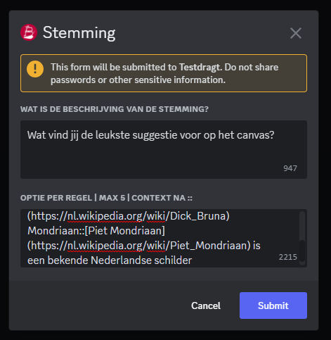

Once you have filled out the modal you will be shown a preview. If it looks good click "Yes, send it" at the bottom.

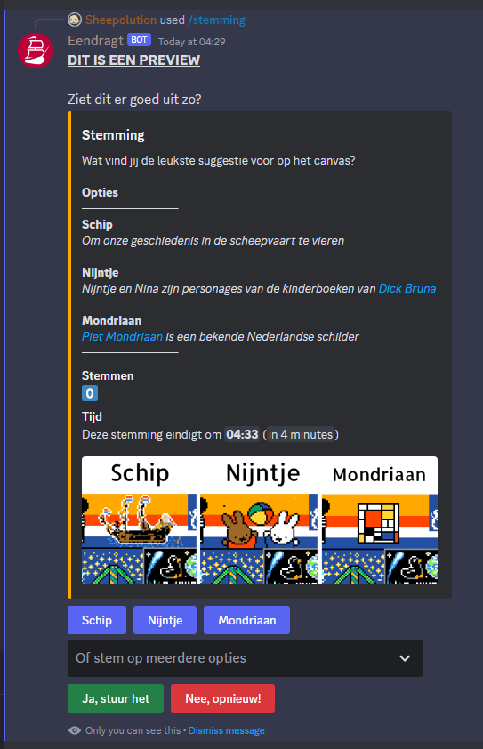

When you have multiple options, a dropdown appears below the buttons. Here you can vote for multiple options at the same time.

When the time is up, the results are displayed, and so is the winner.

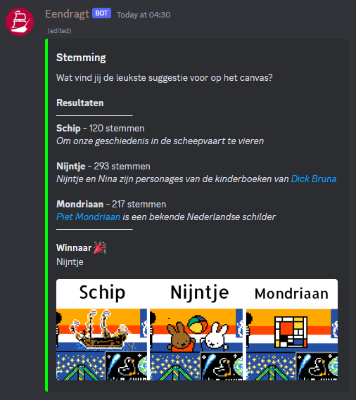

## Diplomacy

### Onboarding

Eendragt automates the onboarding of diplomats. When a member clicks **I'm here for diplomacy** they are presented with the modal below. Here the diplomat enters information about their community, and what they want to discuss.

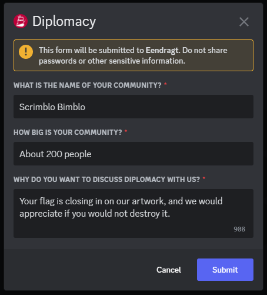

After they fill it out, the member gets the Diplomat role, and a private thread is created in #embassy with just the member. There they will see a welcome message, with an option at the bottom to add up to three members, their fellow Diplomats.

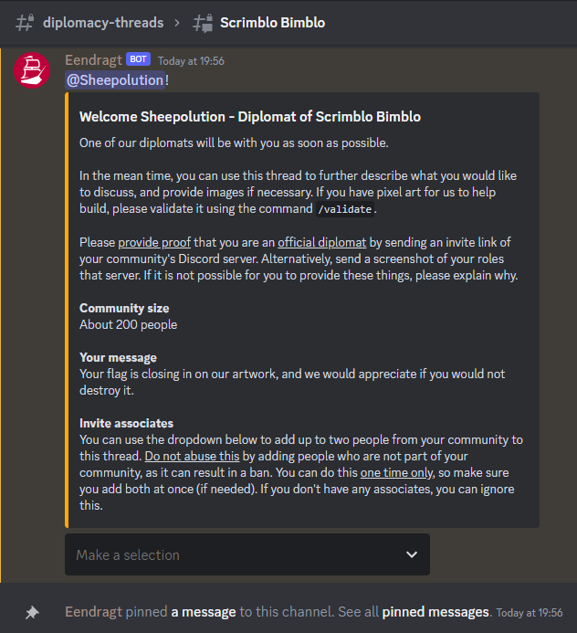

A message will appear in the #dispatch channel with the information entered, and a button. The NL-diplomat who clicks it will be put in the private thread with the diplomat from the community.

Several diplomats from the same community may start a thread. If a thread already exists with a similar name, this will be indicated. The DiploMods can then take action on it.

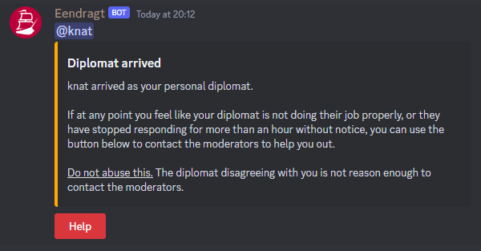

When an NL diplomat behaves unprofessionally, or is absent, the community diplomat can click the Help button. A modal will then open where the diplomat can provide more context about what is going on.

The report is sent into the #reports channel, where DiploMods can determine how to take action.

### Voice

When the diplomat and you want to talk in a voice channel, you can use the `/voice` command to do so.

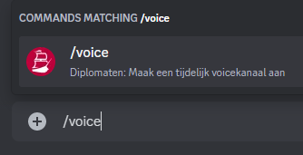

This creates a temporary voice channel. Once someone enters the voice channel it waits until the channel is empty again. Once that happens, the channel is deleted.

### Treaties

If you have agreed on something with a diplomat from another community, it still needs to be approved. Ask a DiploMod to draft a treaty.

The DiploMod can use the `/treaty` command to generate a treaty. There are six choices here:

**Non-Agression**

We agree with the other party that we do not attack each other. It does not mean that we help defend each other, only that we respect each other's boundaries.

**Mutual Defense**

We agree with the other party that if one of us is attacked, the other party will help defend us.

**Solidarity**

We help the other party build artwork, and in return, the other party's community uses our autoplacers. Finally, it is our autoplacers who build their artwork.

**Friendship**

We make friends with the other party. At the border of our territories, we place artwork that is relevant to both of us (e.g., Alfred with Japan).

**Acquisition**

We move the party to another place so that we can claim the spot the party is currently on.

**Custom**

If you cannot use any of the above options, you can create your own treaty.

After executing the command, you get a message with an image. The idea is that you sign it and then send it to the community diplomat so that he too can sign it.

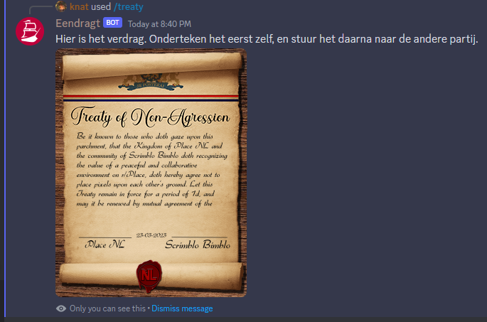

When both parties have signed it, the treaty is complete.

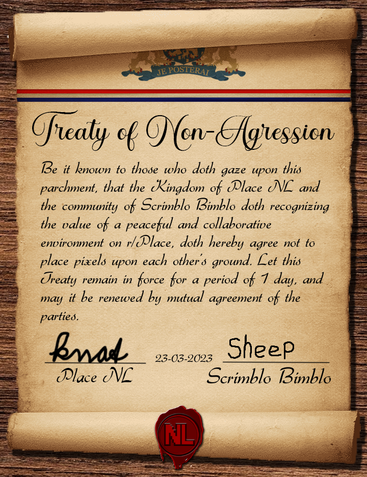